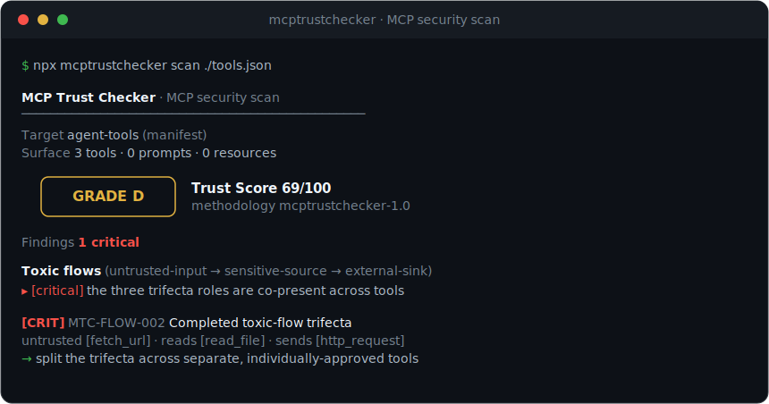

<div align="center">

# 🛡️ MCP Trust Checker

### The local-first, deterministic security scanner for MCP servers

**Know whether a Model Context Protocol server is safe *before* you connect it to your data.**

[](LICENSE)
[](package.json)
[](docs/methodology.md)
[](test)
[](docs/rules.md)
[](#why-this-is-different)
[](#why-this-is-different)
[](https://mcptrustchecker.com/api)
[](https://mcptrustchecker.com/registry)

<br/>



<br/>

```bash
npx mcptrustchecker                # 🔍 scan every MCP server you already have installed — zero config
```

**Zero install?** Run the same deterministic engine as a **free public web API → [mcptrustchecker.com/api](https://mcptrustchecker.com/api)**

<sub>· offline · deterministic · no account · OAuth browser login for protected servers · reads the real published npm/PyPI source · <a href="#the-algorithm-the-capability-flow-trust-model">one novel core</a> ·</sub>

</div>

---

## What makes the algorithm unique

The **Capability-Flow Trust Model** (methodology `mcptrustchecker-1.8`) is an **original algorithm designed from scratch for this project** by [Illia Haidar](https://github.com/illiahaidar) — it is not a wrapper around, or derivative of, any existing scanner or methodology. It is named, versioned, fully specified in [docs/methodology.md](docs/methodology.md), and citable via [CITATION.cff](CITATION.cff).

MCP Trust Checker scores an MCP server the way an **attacker** reasons about it — not as a bag of regex hits, but as a **Capability-Flow Trust Model**. Every tool is reduced to the roles it can actually play — *untrusted-input ingress*, *sensitive-data source*, *external / exec sink* — derived from behavior, **never** from the server's own (attacker-controllable) annotations. Those roles are wired into a **cross-tool toxic-flow graph** that hunts the *lethal trifecta*: the moment untrusted content, private data, and an exfiltration path co-exist in one agent session — whether inside a single tool or composed across several tools plus the client's built-ins. That is the exact shape behind real-world MCP data-exfiltration exploits, and MCP Trust Checker proves the primitive exists **statically**, with an honest confidence split so a single-tool completion reads `confirmed` and a cross-tool composition reads `strong` — never overclaiming.

Three more things sit under that graph:

- **It decodes, not strips.** Unicode Tags-block and variation-selector payloads are *recovered and printed back to you as evidence*, so a hidden "read `~/.ssh/id_rsa` and BCC the attacker" becomes visible text instead of a silent flag.
- **It has rug-pull integrity built in.** The canonical surface is hashed and pinned; any post-approval mutation of a tool definition trips a `confirmed` finding with a per-tool diff.
- **Every point of the 0–100 Trust Score is an auditable, deterministic penalty vector** — fixed severity weights, a confidence multiplier, diminishing returns, per-category caps, and weakest-link gates. Fully reconstructable, identical on every run, gameable by no one. **No LLM in the loop, no telemetry, no account.**

> And it is **comprehensive by design**: the full catalog of known MCP attack techniques is covered in one offline pass — no API key, no LLM. [See the full coverage map ↓](#coverage-the-full-catalog-of-mcp-attack-techniques)

**Jump to:** [Why it's different](#why-this-is-different) · [Quick start](#quick-start) · [The algorithm](#the-algorithm-the-capability-flow-trust-model) · [Coverage](#coverage-the-full-catalog-of-mcp-attack-techniques) · [Scoring](#the-trust-grade-is-auditable-by-construction) · [Embed as a library](#embed-the-exact-same-engine-marketplaces--platforms) · [CI / GitHub](#ci--github-integration) · [Rules](docs/rules.md)

---

## The one question millions of MCP users can't answer

> **"Is this server safe to give access to my files, my tokens, and my conversations?"**

An MCP server hands an AI assistant a set of *tools*. Those tool descriptions are read by the model, not by you — a perfect place to hide instructions. A single server that can *read a file* and *make an HTTP request* is already a data-exfiltration weapon. And a server can look harmless on day one, then silently redefine its tools after you approve it. MCP Trust Checker turns all of that into a transparent letter grade you can act on.

```
   ╭────────────╮
   │  GRADE  D  │   Trust Score 69/100
   ╰────────────╯   methodology mcptrustchecker-1.8

Toxic flows (untrusted-input → sensitive-source → external-sink)
  [critical] The three trifecta roles are co-present across tools;
             a prompt-injected agent can chain them.
```

---

## Why this is different

MCP Trust Checker's wedge is **accuracy + explainability + privacy**, with one genuinely novel core — the cross-tool toxic-flow graph. Every property below holds together in a single offline binary — no account, no LLM in the loop, no telemetry:

- 🔒 **Offline by default** — no account, token, API key, or hosted service; your data never leaves the machine.
- 🔐 **Scans protected remote servers** — `--login` runs the full **OAuth 2.0 browser sign-in** (discovery → dynamic client registration → PKCE → token), so it can audit auth-gated remote MCP endpoints, not just public ones — something most scanners can't do. (Or pass a static `--header "Authorization: Bearer …"`.) Tokens stay in memory for the scan only.
- 🎯 **Deterministic** — same input ⇒ byte-identical score, on every run and every machine.
- 🕸️ **Cross-tool toxic-flow graph** — proves the lethal trifecta statically, composed across tools, not just within one.
- 🔬 **Reads the code, not just the claim** — it grades what the implementation *does* (eval / shell-spawn / hardcoded egress / credential reads / obfuscated payloads), so a poisoned server can't hide behind honest-looking tool descriptions. Metadata **and** implementation, in one deterministic pass.
- 📥 **Deep-scans the actual published package** — `scan <name> --online` fetches the npm/PyPI artifact, verifies it against the registry-declared hash, and runs the full source-analysis engine on the exact bytes `npx`/`pip` would install — **in memory, without installing or executing anything**. Also scans packed release artifacts directly: `scan ./server.tgz`, `.whl`, `.zip`.
- 🧬 **Byte-level rug-pull detection** — the verified artifact's SHA-256 is pinned in the lockfile; if the *same version* is ever republished with different bytes, the rescan raises a `critical`, `confirmed` finding (`MTC-TOFU-002`) — the attack an unchanged tool surface hides from every metadata-only check.
- 🔎 **Decodes, not strips** — hidden Unicode payloads (Tags block / variation-selector) are recovered and shown as evidence.
- 📌 **Rug-pull integrity** — the full tool surface is hashed and pinned; any post-approval drift trips a `confirmed` finding with a per-tool diff.
- 🧾 **Auditable Trust Score** — every point is a published, reproducible penalty vector.
- ⚙️ **SARIF + GitHub Action + CI gates** — machine-readable output and pass/fail thresholds out of the box.
- 📦 **Embeddable library** — the identical, versioned engine a marketplace can reuse on-site.
- 🪶 **MIT, plain-data rules** — every rule is transparent and contribution-friendly.

---

## Measured accuracy

Most scanners *assert* they have a low false-positive rate. This one **measures** it. A labeled corpus of malicious and benign MCP servers lives in [`benchmark/`](benchmark/); `npm run benchmark` scores it and reports the numbers (and fails CI on a regression):

| Metric | Score |
| --- | :---: |
| Precision | **100%** |
| Recall | **100%** |
| F1 | **100%** |
| False-positive rate | **0%** |

*(64 labeled servers, held-out cases flagged; "concerning" := Trust grade C or worse. Reproduce with `npm run benchmark`.)* The corpus is honest and versioned — it grows with every calibration case, and the CI gate holds precision/recall ≥ 90%.

---

## Install

```bash
npx mcptrustchecker scan ./tools.json      # zero-install
npm i -g mcptrustchecker                    # CLI everywhere
npm i mcptrustchecker                       # embed the engine in your app
```

Requires Node ≥ 20. Live scanning uses the official [`@modelcontextprotocol/sdk`](https://www.npmjs.com/package/@modelcontextprotocol/sdk).

---

## Quick start

**Zero-config — one command, scans everything you have installed:**

```bash
npx mcptrustchecker          # auto-discovers Claude Desktop/Code, Cursor, Windsurf, Continue, VS Code configs
```

**Or point it at anything:**

```bash
mcptrustchecker scan ./tools.json                          # an offline manifest (deterministic)
mcptrustchecker scan ./path/to/mcp-server                  # a local package dir — analyzes the CODE too
mcptrustchecker scan --command "npx -y @some/mcp-server"   # a local stdio server (sandboxed)
mcptrustchecker scan https://mcp.example.com/mcp           # a live HTTP/SSE endpoint
mcptrustchecker scan https://mcp.example.com/mcp --login   # an OAuth-protected endpoint (browser sign-in)
mcptrustchecker scan https://mcp.example.com/mcp --header "Authorization: Bearer <token>"   # static auth
mcptrustchecker scan @modelcontextprotocol/server-filesystem --online   # fetches + verifies + reads the PUBLISHED source
mcptrustchecker scan mcp-server-fetch --online --registry pypi          # same for PyPI (sdist/wheel)
mcptrustchecker scan ./server-1.2.0.tgz                    # a packed release artifact (.tgz/.whl/.zip) — offline
```

**Outputs & CI gates:**

```bash
mcptrustchecker scan ./tools.json --sarif > mcptrustchecker.sarif   # GitHub code scanning
mcptrustchecker scan ./tools.json --md    > report.md        # PR comment
mcptrustchecker scan ./tools.json --json  > report.json      # machine-readable
mcptrustchecker scan ./tools.json --badge > badge.json       # shields.io endpoint
mcptrustchecker scan ./tools.json --fail-under 80            # exit 1 below a threshold
mcptrustchecker scan ./tools.json --min-grade B             # exit 1 below a grade
```

The terminal report is **detailed by default** — every finding prints its full description (**what** the problem is and **why** it matters), the exact location, the offending **evidence**, a **fix**, and its OWASP mapping, grouped most-severe-first. Add `--details` for external references, or `--quiet` for just the grade line.

**No install? Use the free hosted API.** A hosted version of the exact same deterministic engine runs at **[mcptrustchecker.com/api](https://mcptrustchecker.com/api)** — POST a `tools.json` manifest or a published npm/PyPI package name over a single HTTPS request and get the same auditable A–F Trust Score back as JSON. It is **completely free** (grab a key in seconds, no card, no account), and it's the quickest way to try the scanner without installing anything. The CLI and library stay 100% offline — the hosted API is an optional convenience.

**Browse the MCP Trust Registry** — a growing, security-scanned catalog of MCP servers with an A–F Trust Score for each, all computed by this exact engine: **[mcptrustchecker.com/registry](https://mcptrustchecker.com/registry)**.

---

## The algorithm: the Capability-Flow Trust Model

A 9-stage pipeline over a **normalized, transport-agnostic surface** (tools, prompts, resources, server instructions, transport, package metadata). Each stage emits findings; the scorer turns them into an auditable grade.

```
INPUT ─ manifest.json │ live stdio/http │ client config │ package name
  │
  ▼
[0] SAFE ACQUISITION        allow-listed command (bare-name only) · scrubbed env · timeouts · SSRF guard
  ▼
[1] UNICODE INTEGRITY       decode Tags/variation-selector payloads; BiDi; zero-width; homoglyph; ANSI
  ▼
[2] INJECTION HEURISTICS    tool-poisoning · line-jumping · shadowing · secrecy · exfil · embedded secrets
  ▼
[3] CAPABILITY EXTRACTION   tag tools (untrusted-input / sensitive-source / sink / exec / write);
  │                         annotation mismatch; sampling/elicitation; schema injection preconditions
  ▼
[4] TOXIC-FLOW GRAPH  ★     the lethal trifecta across tools AND client built-ins; + name-collision
  ▼
[5] SUPPLY-CHAIN            typosquat/combosquat/homoglyph · install-scripts · provenance · unpinned · deps
  ▼
[6] TRANSPORT POSTURE       stdio-RCE · plaintext HTTP · 0.0.0.0 · DNS-rebinding · known-CVE version matcher
  ▼
[7] RUG-PULL INTEGRITY      SHA-256 pin of the full schema → diff on every rescan
  ▼
[8] SCORING                 deterministic penalties · diminishing returns · category caps · hard gates
  ▼
OUTPUT ─ terminal │ JSON │ SARIF 2.1.0 │ Markdown │ badge
```

**★ The flagship — cross-tool toxic-flow analysis.** The most dangerous MCP failures aren't one bad tool; they're an innocent *combination*. Give an agent (1) exposure to **untrusted content**, (2) access to **sensitive data**, and (3) a way to **communicate externally**, and you have an exfiltration primitive. MCP Trust Checker derives each tool's roles from behavior (not from its self-declared, attacker-controllable `annotations`) and checks whether the three are co-reachable across every tool, every server, and optionally the client's own built-ins (`--include-builtins`). One tool holding all three → **critical, confirmed**; the roles spread across tools → **critical, strong**.

Full depth: **[docs/methodology.md](docs/methodology.md)**.

---

## Coverage: the full catalog of MCP attack techniques

MCP Trust Checker covers the full catalog of known MCP attack techniques in one offline pass — from tool-poisoning and Unicode smuggling to supply-chain risk and cross-tool toxic flows — plus the flow graph, the decoder, the integrity pin, and the auditable score on top. ★ marks a check that goes beyond what static scanners typically catch.

<details>
<summary><b>📋 Full technique → rule coverage map</b> (37 techniques — click to expand)</summary>

<br/>

| Attack / technique | MCP Trust Checker rule(s) |
| --- | --- |
| Tool poisoning (hidden instructions in descriptions) | `MTC-INJ-AUTH-*`, `MTC-INJ-SECRECY-*`, `MTC-INJ-TARGET-*`, `MTC-INJ-POISON` |
| Prompt injection / instruction override | `MTC-INJ-AUTH-2`, `MTC-INJ-SECRECY-1` |
| Line jumping (pre-invocation seeding) | `MTC-INJ-SEQ-1` |
| Tool shadowing via description redirect | `MTC-INJ-SHADOW-1` |
| Cross-**server** tool-name collision / homoglyph name | `MTC-INJ-SHADOW-2` ★ |
| Tool-selection ranking manipulation | `MTC-INJ-SHADOW-3` ★ |
| Invisible-Unicode channels (zero-width/BiDi/Tags/VS) | `MTC-UNI-001..008` (decoded) ★ |
| Homoglyph / mixed-script | `MTC-UNI-009` |
| ANSI terminal-escape deception | `MTC-UNI-010` ★ |
| Encoded-payload smuggling (base64 + decode) | `MTC-INJ-ENC-1/2` |
| Shell/command-injection strings in prose | `MTC-INJ-CMD-1`, `MTC-CAP-001` |
| Command/code-execution capability | `MTC-CAP-001` |
| Filesystem-mutation capability | `MTC-CAP-002` |
| Annotation spoofing (readOnly/destructive lie) | `MTC-CAP-003` |
| openWorldHint + sensitive read (trifecta signal) | `MTC-CAP-004` ★ |
| **Toxic-flow analysis / lethal trifecta** | `MTC-FLOW-001..005` ★ |
| Command-injection sink precondition (schema) | `MTC-CAP-006` ★ |
| SSRF / cloud-metadata sink precondition (schema) | `MTC-CAP-007` ★ |
| Path-traversal precondition (schema) | `MTC-CAP-008` ★ |
| Sampling-capability abuse | `MTC-CAP-009` ★ (static proxy) |
| Elicitation abuse / consent phishing | `MTC-CAP-010` ★ (static proxy) |
| Rug pull / silent tool-definition mutation | `MTC-TOFU-001` + lockfile |
| Unpinned / @latest auto-update (rug-pull enabler) | `MTC-SUP-013` ★ |
| Typosquat / combosquat / homoglyph squat | `MTC-SUP-001..006` |
| Install-script / provenance risk | `MTC-SUP-010/011/012` |
| Dependency squat / advisory match | `MTC-SUP-014` ★ |
| Known-CVE version matching | `MTC-NET-001` |
| stdio-RCE (unallowlisted command) | `MTC-NET-002` + sandboxed acquisition |
| Plaintext HTTP / 0.0.0.0 bind | `MTC-NET-003/004` |
| DNS rebinding on localhost transport | `MTC-NET-006` ★ |
| Embedded credential value in metadata | `MTC-INJ-SECRET-1` ★ |
| Empty/malformed surface ≠ clean | `MTC-META-001` ★ |
| Config discovery across MCP clients | client-config parser + zero-config auto-discovery |
| Malicious URL / exfil endpoint in tool metadata | `MTC-INJ-URL-1` ★ |
| **Implementation-level sinks** — eval / shell-spawn / hardcoded egress / deserialization | `MTC-SRC-001…011` ★ |
| Credential-path read / environment dump in server code | `MTC-SRC-006` ★ |
| Hardcoded secret in the server's source (not just metadata) | `MTC-SRC-008` ★ |
</details>

**Deliberately out of scope** (so the deterministic, offline, no-account promise holds): LLM-as-judge semantic classification, hosted threat-intel, a runtime guardrail *proxy*, live authN/replay/signing probing, and OAuth-endpoint source analysis. Where a runtime-only class has a static proxy — a *declared* sampling/elicitation capability, an *unbounded* URL/command/path parameter — MCP Trust Checker flags the precondition offline instead.

Full list: **[docs/rules.md](docs/rules.md)** · run `mcptrustchecker rules`.

---

## The axes: Trust (grade), Capability (blast radius), Coverage (depth), Verification (source)

A single number can't answer "should I use this server?" — because **"powerful" and "malicious" are different questions**, and a clean grade means nothing if the scan barely saw the server. So MCP Trust Checker separates the signals, then folds the client-adoption-risk ones back into the grade transparently (see [scoring ↓](#the-trust-grade-is-auditable-by-construction)):

- **Trust — the A–F grade.** Driven by *threat* signals: prompt-injection with concealment, embedded secrets, Unicode smuggling, typosquatting, known CVEs, rug-pull drift, annotation lies, a single tool built as an exfiltration primitive. Answers **"any sign this server is malicious or negligent?"** — this is the pure `threatScore`, preserved on every report.
- **Capability — a level (Minimal → Critical).** Driven by what the server *can do*: code execution, filesystem writes, network egress, the cross-tool toxic-flow surface. Answers **"how much damage if the model driving it is manipulated?"** — a fact to size access against, **not** a mark against the server. It contributes a small **capability-exposure** term to the client score.
- **Coverage — a level (Live → Source → Manifest → Metadata → Empty).** How much the scan could actually inspect. A Grade A from a `metadata`-only scan (no tools enumerated, no code read) is **not** the assurance of a Grade A from a `live` scan that saw the real runtime tools. It contributes a small **coverage-honesty** term, so a shallow scan is never mistaken for a clean bill of health. When coverage is partial, the report says exactly what it could not see.
- **Verification — the source (Vendor → Source → None; Unknown offline).** Established from facts the publisher cannot forge — npm/PyPI build provenance (Sigstore/SLSA) and vendor-owned scopes — computed by the engine on an `--online` scan so the CLI, registry and hosted API all agree. It contributes a small **verification-discount** term. Offline it is `Unknown` and the term is skipped (a caveat says so), because an unchecked signal must never read as verified.

```
firecrawl   Trust B (81/100)   Capability CRITICAL   Coverage LIVE     → trustworthy, but huge blast radius — grant carefully
poisoned    Trust F            Capability HIGH        Coverage LIVE     → actual malice signals — avoid
memory      Trust A (100)      Capability MINIMAL     Coverage LIVE     → safe and low-power
some-pkg    Trust A (98)       Capability MINIMAL     Coverage METADATA → clean *so far* — 0 tools seen; scan the live server
```

This is why MCP Trust Checker doesn't collapse every capable server into "F" (which would make the grade useless). Popularity is never an input — popular packages get compromised — but a legitimate powerful server keeps a high Trust grade while its Capability and the scan's Coverage are surfaced honestly.

## The Trust grade is auditable by construction

Every scan mode answers **one** question: *how safe is this MCP for the **user** who wants to adopt it* — the client's adoption risk, not a judgement of the developer. So the score is computed in two auditable stages: a pure **threat score**, then three small, subtract-only **client-adoption-risk** terms that evolve it into the final **client score**. Both stages ship in the itemized `vector`.

**Stage 1 — the threat score** (unchanged; malice/negligence only):

```
ThreatScore = clamp( 100 − Σ_categories min(CategoryCap, Σ penalty), 0, 100 )
penalty     = severity_weight × confidence_multiplier × diminishing_factor    (threat findings only)
```

| Severity | Weight | | Confidence | × |
| --- | ---: | --- | --- | ---: |
| Critical | 45 | | Confirmed | 1.0 |
| High | 22 | | Strong | 0.7 |
| Medium | 9 | | Heuristic | 0.4 |
| Low | 3 | | Speculative | 0.2 |

- **Diminishing returns** (`1 · ½ · ¼ · …`) so 40 copies of one nit can't tank a server and benign passes can't dilute one critical.
- **Per-category caps** (injection 50, exfiltration 50, permissions 35, supply-chain 30, network 25, hygiene 10).
- **Hard gates** (weakest-link): a **confirmed critical → F**; **any** critical → at most **D**; a confirmed high → at most **C**; two → **D**. Most gates fire only on `confirmed` findings so a guess never forces a cap — but no critical of any confidence can score above D.

**Stage 2 — the client score** (the number you read):

```
ClientScore = clamp( round( ThreatScore − E_cap − E_ver − E_cov ), 0, 100 )
Grade       = stricter( band(ClientScore), threat_gate_cap )        // the F-gate is never softened
```

Three subtract-only terms, each **one itemized line** in `vector` — no black box, and the score can never *rise* above the threat score:

| Term | Meaning (the client's risk in adopting) | Points |
| --- | --- | --- |
| **E_cap** — capability exposure | blast radius if the model driving the server is manipulated | minimal 0 · moderate 3 · high 6 · critical 10 |
| **E_ver** — verification discount | how verifiable the *source* is (build provenance / vendor scope / public repo) | vendor 0 · provenance 0 · public repo 1 · none 5 · **unknown → term skipped** |
| **E_cov** — coverage honesty | how much of the target the scan could actually inspect | live 0 · source 0 · manifest 4 · metadata 8 · empty 10 |

- **Verification is an engine signal**, computed from the fetched npm/PyPI document (Sigstore/SLSA provenance + vendor-owned scope) on an `--online` scan — identical logic in the CLI, the registry and the hosted API, so every mode agrees. An **offline** scan cannot check provenance, so verification is `unknown`, the term is **skipped**, and a coverage caveat records the omission — an unchecked signal never reads as clean.
- The terms are **subtract-only**: a threat-clean server is never dragged below **B** by exposure alone (validated on 31,300 real packages; clean floor = 87), and the confirmed-critical **F-gate holds** regardless.
- **Bands:** A 90–100 · B 80–89 · C 70–79 · D 60–69 · F 0–59.

Every report ships the full itemized `vector` (threat penalties **and** the three client terms), the preserved `threatScore`, and the `methodologyVersion`. **Same methodology version + same target ⇒ byte-identical score.** Details: **[docs/scoring.md](docs/scoring.md)**.

---

## Embed the exact same engine (marketplaces & platforms)

MCP Trust Checker is a library first. A marketplace can vet every listed server with **the identical, versioned open-source engine** users audit on GitHub — so "we run unique security checks on every MCP server" becomes a *verifiable* claim.

```ts
import { surfaceFromManifest, scanSurface, renderBadge } from 'mcptrustchecker';

const surface = surfaceFromManifest(toolsJson, 'acme/weather-mcp');
const report  = await scanSurface(surface);

report.score.grade;              // 'A' … 'F'
report.score.score;              // 0 … 100
report.score.methodologyVersion; // 'mcptrustchecker-1.8'  ← pin & display this
report.toxicFlows;               // enumerated exfiltration primitives
renderBadge(report);             // shields.io endpoint JSON for a live trust badge
```

`scanSurface` is pure, deterministic, and offline. See **[examples/programmatic.ts](examples/programmatic.ts)**.

---

## Rug-pull protection (Trust On First Use)

```bash
mcptrustchecker pin  ./tools.json    # writes mcptrustchecker.lock — commit it to git
mcptrustchecker diff ./tools.json    # exits non-zero if the surface changed
```

A tool that quietly rewrites its description after you approve it (the MCPoison / rug-pull class) shows up as **drift** with a human-readable diff, and re-approval is required.

---

## Publish to the MCP Trust Registry (opt-in, off by default)

Scanned a package worth listing? You can submit it to the public **[MCP Trust Registry](https://mcptrustchecker.com/registry)** so everyone else can look it up before installing it.

```bash
mcptrustchecker publish @scope/server --token <key>    # scan it, then submit it
mcptrustchecker scan @scope/server --online            # just scan — never publishes, never asks
```

**Publishing is a separate command, never a side effect of scanning.** `scan` does not publish, does not ask, and does not change behaviour when a key happens to be in your environment — the only way anything is submitted is by typing `publish`, and typing it is the consent. There is no prompt to dismiss and no telemetry. **Only npm and PyPI packages can be submitted for now**; a target with no registry identity (a local directory, a `.tgz`, a manifest, a live URL, a spawned stdio command) is refused with an explanation rather than silently skipped.

`publish` always reads the real published source — it implies `--online`, because submitting a package graded from its name alone would be worse than not grading it at all.

**What is sent is an application, not a verdict.** The request carries the package identity (registry + name, optionally the version) and your explicit consent — no scan report, no findings, no source, nothing about your machine or your configs. **mcptrustchecker.com re-scans the package with its own copy of this engine**, and only that server-side scan is ever published. Your local grade travels along as `localGrade` for comparison only and can never become the listed grade — which is exactly what stops a key-holder from publishing "grade A" for a malicious package.

A missing key or an unpublishable target fails fast, before the package is downloaded. A network failure while submitting warns on stderr and leaves stdout untouched.

Publishing from CI is deliberately not something the GitHub Action does for you — a workflow that submits packages because a secret happens to exist is the same side effect this design removes. Write it as its own step when you want it:

```yaml
- name: Publish to the MCP Trust Registry
  run: npx mcptrustchecker publish @scope/server --token "$MCPTRUSTCHECKER_TOKEN"
  env:
    MCPTRUSTCHECKER_TOKEN: ${{ secrets.MCPTRUSTCHECKER_TOKEN }}
```

**Getting a key.** Grab a free API key at **[mcptrustchecker.com/api](https://mcptrustchecker.com/api)** — the same key the hosted scan endpoints use, no card, no account. Store it in the environment rather than in a committed file:

```bash
export MCPTRUSTCHECKER_TOKEN=<key>          # the key, read automatically
export MCPTRUSTCHECKER_PUBLISH_URL=https://mcp.internal   # self-hosted deployment (optional)
```

| Flag | What it does |
| --- | --- |
| `publish <package>` | the command — scan the package, then submit it |
| `--category <slug>` | registry category to file it under (default `other`) |
| `--token <key>` | API key (env: `MCPTRUSTCHECKER_TOKEN`) |
| `--publish-url <origin>` | publish to a self-hosted deployment (env: `MCPTRUSTCHECKER_PUBLISH_URL`) |

Credentials also live in `mcptrustchecker.config.json` as `publishToken`, `publishUrl` and `publishCategory`, resolved **flag → environment → config file**. There is deliberately no config key that turns publishing on: a file you inherited from someone else must never be able to submit your packages.

---

## CI / GitHub integration

```yaml
# .github/workflows/mcptrustchecker.yml
name: MCP Trust Checker
on: [push, pull_request]
jobs:
  scan:
    runs-on: ubuntu-latest
    permissions: { contents: read, security-events: write }
    steps:
      - uses: actions/checkout@v4
      - uses: illiahaidar/mcptrustchecker@v0
        with:
          target: ./tools.json
          min-grade: B
          sarif: true          # uploads to the Security tab
```

See **[docs/ci-integration.md](docs/ci-integration.md)** and **[action.yml](action.yml)**.

---

## Safety: scanning is itself an attack surface

Connecting to an MCP config can run arbitrary commands. MCP Trust Checker's acquisition is sandboxed by default:

- stdio commands are **allow-listed by bare name** (`npx, uvx, python, python3, node, docker, deno`) — a **path-qualified** command (e.g. `/tmp/evil/node`) is refused, closing the basename-spoof bypass.
- child env is **scrubbed** of execution-hijacking variables (`NODE_OPTIONS`, `LD_PRELOAD`, `DYLD_*`, `PYTHON*`, `()`-functions) — an allow-listed runtime can't be redirected.
- servers in a client config are **not spawned** unless you pass `--run`; config-derived HTTP targets are **SSRF-guarded** (private/loopback/link-local blocked).
- HTTP targets are scheme/host-validated; responses are size-capped; all connects are timeout-bounded.

---

## Configuration

`mcptrustchecker.config.json` (auto-discovered) overrides any default — see [examples/mcptrustchecker.config.json](examples/mcptrustchecker.config.json). Two adoption features worth calling out:

- **Baseline / suppressions** — waive a specific finding on a specific tool with a justification (`suppress: [{ rule, tool?, field?, reason }]`), or drop a standalone `.mtcignore` JSON array in your repo. Location-scoped waivers keep CI green without silencing a rule everywhere.
- **Policy-as-code** — declare what "acceptable" means once and gate every scan on it: `policy: { minGrade, maxCapability, denyRules, denyCapabilities }`. Violations print and fail the run.

---

## What MCP Trust Checker is *not*

- Not a runtime proxy/firewall — it analyzes the declared surface, it doesn't sit in the request path.
- Static analysis proves a toxic-flow **primitive exists**, not that a chain **will execute**.
- It does not test server-side auth/authorization (noted, not claimed).
- Heuristics have false positives; every finding carries a `confidence`, and grade gates fire only on `confirmed` findings — so a guess never forces a grade. [Report false positives](.github/ISSUE_TEMPLATE/false-positive.md); the rules are open.

---

## Documentation

- **[docs/methodology.md](docs/methodology.md)** — every pipeline stage in depth
- **[docs/scoring.md](docs/scoring.md)** — the scoring model & reproducibility contract
- **[docs/rules.md](docs/rules.md)** — the complete 78-rule catalogue
- **[docs/architecture.md](docs/architecture.md)** — code layout & how to extend
- **[docs/ci-integration.md](docs/ci-integration.md)** — Action, SARIF, baselines
- **[SECURITY.md](SECURITY.md)** · **[CONTRIBUTING.md](CONTRIBUTING.md)**

---

## Contributing

Issues, rules, and PRs welcome — see [CONTRIBUTING.md](CONTRIBUTING.md). New detectors implement one small interface; new threat data is a plain, reviewable data file with a test.

## License

[MIT](LICENSE) © Illia Haidar · [mcptrustchecker.com](https://mcptrustchecker.com) · [support@mcptrustchecker.com](mailto:support@mcptrustchecker.com).

Created and maintained by **[Illia Haidar](https://github.com/illiahaidar)** — author of the Capability-Flow Trust Model.
